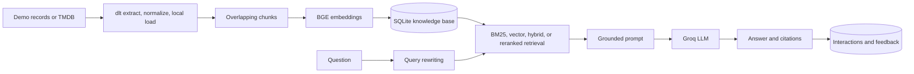
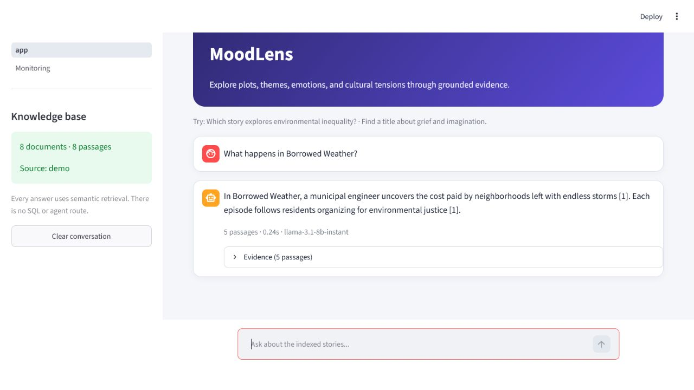
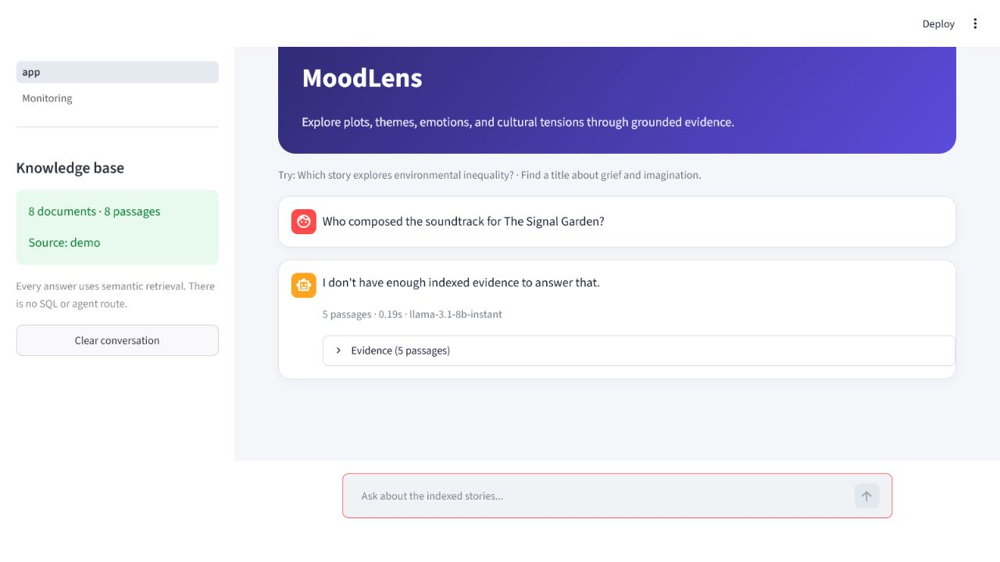

# MoodLens

MoodLens is a local-first retrieval-augmented generation application for exploring plots,
emotions, and cultural themes in film and television descriptions. It retrieves relevant passages
from a local SQLite knowledge base, asks a Groq-hosted language model to answer only from that
evidence, and shows the evidence beside the answer.



There is no SQL-answering mode or agent router. Application answers always follow the evaluated RAG
route. Four retrieval approaches are benchmarked. BM25 is the configured production winner for the
versioned demo benchmark; vector, hybrid reciprocal-rank fusion, and reranked vector retrieval remain
available for evaluation.

## Problem and intended users

Plot summaries and reviews contain useful cultural signals, but they are difficult to explore across
many titles. MoodLens lets viewers, students, and cultural researchers ask questions such as:

- Which indexed story explores environmental inequality?
- Find a title about grief and imagination.
- How does *The Winter Orchestra* portray adaptation?
- Which stories are concerned with public identity or fame?

If the indexed evidence does not contain an answer, the selected prompt instructs the model to refuse
instead of filling the gap with outside knowledge.

## Dataset

The zero-credential demonstration corpus contains eight fictional records written specifically for
this learning project:

- Four movies
- Four television series
- Eight overview documents
- Eight chunks with the default chunk settings

The fictional records avoid licensing ambiguity and make evaluation fully reproducible. They are not
presented as real releases. End users do not have to scrape anything: demo ingestion works without a
TMDB account.

Maintainers can optionally replace the demo corpus with current TMDB overviews and first-page user
reviews. The TMDB workflow uses the date range and limits in `.env`, downloads the records locally,
and writes timestamped copies under `artifacts/`.

## Local setup

Python 3.12 is recommended.

```powershell
python -m venv .venv
.\.venv\Scripts\Activate.ps1
python -m pip install -r requirements.txt
Copy-Item .env.example .env
```

Set the Groq credential in `.env`:

```env
GROQ_API_KEY=your-groq-api-key
```

Never commit `.env`; it is ignored by Git.

Run the automated dlt ingestion and indexing pipeline, then start Streamlit:

```powershell
python scripts\ingest.py --source demo
streamlit run app.py
```

Open `http://localhost:8501`. Streamlit navigation contains the monitoring page.

## Application examples

An answerable plot question produces a grounded answer with numbered evidence citations:



When the indexed passages do not contain the requested information, the chatbot refuses rather than
inventing an answer:



Ask one question from the terminal:

```powershell
python scripts\ask.py "Which story explores environmental inequality?"
```

## Automated ingestion and optional TMDB refresh

`dlt` extracts and normalizes every source, infers its schema, records load IDs, and stores a local
JSONL dataset under `artifacts/dlt/`. The second stage chunks and embeds the validated records,
atomically replaces the SQLite knowledge base, and writes a human-readable snapshot under
`artifacts/corpora/`.

For a live refresh, add `TMDB_API_KEY` to `.env`, adjust the configured dates and limits, and run:

```powershell
python scripts\ingest.py --source tmdb
```

API keys are transmitted to TMDB but are never written into artifacts or error messages. The
pipeline uses local files only; no cloud data destination is configured.

### Zero-download smoke-test backend

BGE through `sentence-transformers` is the default for vector-capable retrieval. On a constrained
machine, the complete application and deterministic benchmark can run without a model download:

```powershell
$env:EMBEDDING_BACKEND="hashing"
python scripts\ingest.py --source demo
streamlit run app.py
```

The hashing backend uses stable word and bigram feature hashing. It is lexical and the committed
report is explicitly labelled accordingly; it is not presented as a semantic-embedding result.

## Evaluation

### Retrieval evaluation

The retrieval golden set contains ten exact-title and paraphrased questions. Every relevant chunk ID
comes from the versioned demo corpus. The evaluator compares BM25, vector search, hybrid BM25/vector
search using reciprocal-rank fusion, and vector search followed by a metadata-aware reranker.

```powershell
python scripts\evaluate_retrieval.py
```

The report contains Hit Rate@K, MRR, Recall@K, Precision@K, mean latency, and every retrieved ID. The
committed deterministic report is
[`data/evaluation/results/retrieval_evaluation.json`](data/evaluation/results/retrieval_evaluation.json).
It was generated with the labelled hashing backend; remove that environment override to evaluate the
same strategies with BGE.

| Strategy | Hit Rate@5 | MRR | Recall@5 | Precision@5 |
|---|---:|---:|---:|---:|
| BM25 **(selected)** | 1.00 | 1.00 | 1.00 | 0.323 |
| Vector | 1.00 | 0.90 | 1.00 | 0.200 |
| Hybrid RRF | 1.00 | 0.95 | 1.00 | 0.200 |
| Vector + reranking | 1.00 | 1.00 | 1.00 | 0.200 |

BM25 wins the deterministic tie-break after matching the reranked path's MRR. The application default
is therefore `RETRIEVAL_STRATEGY=bm25`.

### LLM evaluation

Answer evaluation uses five questions, including one deliberately unsupported question. It compares
a baseline prompt with the strict grounded prompt. A separate Groq call scores relevance and
groundedness on a 0–2 scale; deterministic policy checks score citations for supported answers and
the exact refusal for unsupported questions.

```powershell
python scripts\evaluate_answers.py
```

The dated judgements are committed at
[`data/evaluation/results/llm_evaluation.json`](data/evaluation/results/llm_evaluation.json).

| Prompt | Relevance | Groundedness | Policy compliance | Composite |
|---|---:|---:|---:|---:|
| Baseline | 1.00 | 1.00 | 0.00 | 0.667 |
| Strict **(selected)** | 1.00 | 1.00 | 1.00 | 1.00 |

The application default is `PROMPT_VARIANT=strict`, the measured winner. Groq-based results can vary
on reruns, so the report includes its model and generation timestamp.

## Monitoring and feedback

Each interaction records the question, answer, model, timestamp, retrieved IDs, mean similarity,
end-to-end latency, token usage, and errors. The chat has thumbs-up/down controls.

The monitoring page contains six charts:

1. Requests by day
2. Mean latency by day
3. Retrieval similarity
4. Feedback distribution
5. Tokens by day
6. Errors by day

It also shows summary metrics and recent interactions. All telemetry remains in local SQLite.

## Docker Compose

Create `.env`, set `GROQ_API_KEY`, and run:

```powershell
docker compose up --build
```

The Compose application builds the image and automatically creates the demo index on first start.
Named volumes persist SQLite, corpus artifacts, dlt state, and the Hugging Face model cache.

Run a TMDB refresh inside Compose with:

```powershell
docker compose --profile tools run --rm ingest-tmdb
```

## Tests

```powershell
python -m pip install -e ".[dev]"
python -m unittest discover -s tests -v
ruff check .
```

Tests cover chunk stability, corpus replacement, vector ranking, BM25, rank fusion, query rewriting,
grounded prompt construction, RAG orchestration, multi-strategy evaluation, golden-set integrity, and
monitoring/feedback persistence. GitHub Actions runs the lightweight unit and lint checks.

## Repository layout

```text
app.py                         Streamlit chat
pages/1_Monitoring.py          Local monitoring dashboard with six charts
data/evaluation/               Versioned golden sets and committed reports
scripts/ingest.py              Demo or TMDB automated ingestion entry point
scripts/ask.py                 Terminal RAG query
scripts/evaluate_retrieval.py  Four-way retrieval evaluation
scripts/evaluate_answers.py    Baseline-versus-strict LLM evaluation
src/moodlens/
  models.py                    Domain types
  chunking.py                  Stable overlapping chunks
  tmdb.py                      Optional TMDB downloader
  dlt_pipeline.py              Automated local dlt extraction and loading
  embeddings.py                BGE and deterministic smoke-test encoders
  database.py                  SQLite corpus and telemetry persistence
  retrieval.py                 BM25, vector, hybrid RRF, reranking, rewriting
  generation.py                Evaluated prompts and Groq adapter
  assistant.py                 RAG orchestration
  evaluation.py                Retrieval metrics and LLM judge
tests/                         Fast isolated unit tests
```

## Design decisions and limitations

- **SQLite instead of a hosted vector database:** the corpus is small, local persistence is easy to
  inspect, and NumPy dot products are sufficient. A large deployment would need an indexed store.
- **Fixed RAG instead of an agent:** every supported question needs the same retrieval operation. An
  agent loop would add cost and unpredictability without another meaningful tool.
- **Demo data before live ingestion:** reviewers can reproduce the project without credentials. TMDB
  is an optional maintainer workflow; its availability and result count depend on its API.
- **Visible sources and stable IDs:** retrieved passages and scores are inspectable, and reports cannot
  silently refer to an older corpus.
- **Scale:** the demo corpus is intentionally small and brute-force vector search is not suitable for
  millions of chunks.
- **External generation:** answers require network access and a valid Groq key; automated judging
  complements rather than replaces human review.

## Evaluation-criteria map

This table follows the official
[LLM Zoomcamp project criteria](https://github.com/DataTalksClub/llm-zoomcamp/blob/main/project.md#evaluation-criteria).
Cloud deployment is intentionally out of scope and no deployment points are claimed.

| Criterion | Evidence | Target |
|---|---|---:|
| Problem description | Intended users, questions, data, refusal behavior, and limitations above | 2/2 |
| Retrieval flow | SQLite knowledge base → retrieval → evidence prompt → Groq LLM | 2/2 |
| Retrieval evaluation | Four compared strategies; committed report; BM25 winner configured | 2/2 |
| LLM evaluation | Baseline vs strict prompts; committed report; strict winner configured | 2/2 |
| Interface | Streamlit chat, visible sources, feedback controls, monitoring page | 2/2 |
| Ingestion pipeline | Automated dlt extraction/normalization/local load and atomic indexing | 2/2 |
| Monitoring | Feedback collection and dashboard with six charts | 2/2 |
| Containerization | App, automatic ingestion, TMDB job, and volumes in Compose | 2/2 |
| Reproducibility | Accessible demo data, pinned dependencies, commands, tests, reports | 2/2 |
| Hybrid search | BM25 + vector reciprocal-rank fusion implemented and evaluated | 1/1 |
| Document reranking | Vector candidates metadata/lexical reranked and evaluated | 1/1 |
| Query rewriting | Deterministic domain expansion enabled and unit-tested | 1/1 |
| Cloud deployment | Explicitly excluded | 0 bonus |

The target is **21/21 non-cloud points**. Peer reviewers make the final score.

## Provenance and AI-assistance disclosure

This is a new learning and disclosed portfolio implementation inspired by the public
[DataTalksClub LLM Zoomcamp](https://github.com/DataTalksClub/llm-zoomcamp) curriculum. It was created
with substantial assistance from OpenAI Codex, including architecture, implementation, tests, and
documentation. It should not be represented as unaided work.

The source files were not copied from the earlier `pop-culture-detective` or `final-project`
repositories. The general subject—RAG over film and television information—was retained, while the
package structure, storage design, domain model, demo corpus, evaluation data, prompts, and app were
newly written for this disclosed learning project.

If this work is adapted for an assessed submission, the author must follow that institution's AI-use
rules and retain an accurate disclosure.
